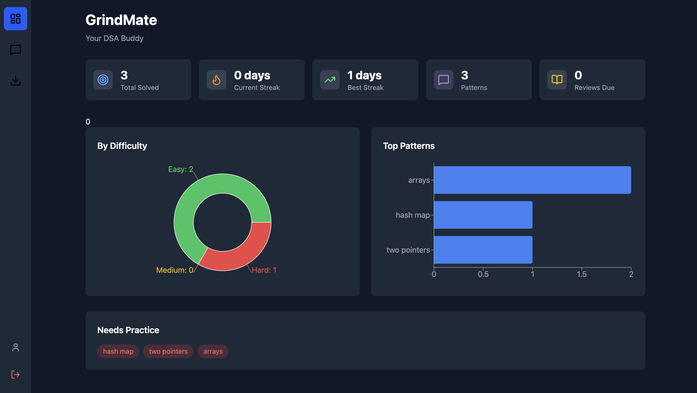
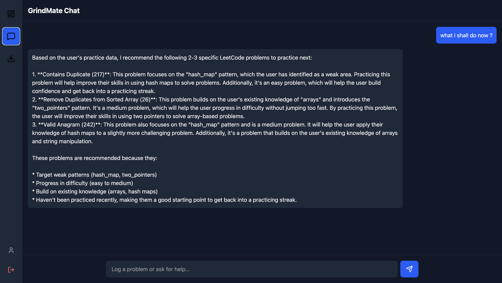

# GrindMate — AI LeetCode Companion

I built this because I was mass-applying to jobs and grinding LeetCode like everyone else, but I kept forgetting which problems I'd solved, which patterns I was weak in, and when I last practiced dynamic programming. Spreadsheets felt tedious. I wanted something that understood natural language — "solved two sum easy 10 min" — and tracked everything automatically.

GrindMate is a full-stack app that runs entirely on Cloudflare's edge. You log problems by chatting with it, it extracts patterns and difficulty using AI, tracks your streaks, and tells you what to practice next. Each user gets isolated data via GitHub OAuth — your practice history is yours alone.

**Live:** [grindmate.sanketjanger15.workers.dev](https://grindmate.sanketjanger15.workers.dev)

---

## How it works

```
React Frontend → Cloudflare Worker (Hono) → Durable Object → D1 + Workers AI
```

**Frontend** is React + Vite + Tailwind, built and served from the Worker. Three pages: Dashboard (charts and stats), Chat (AI interface), and Import (coming soon). The sidebar navigation lets you switch between views. All styling uses Tailwind v4 with a dark theme.

**Worker** (`src/index.ts`) is a Hono router handling API routes and GitHub OAuth. It's the entry point for every request. Auth routes redirect to GitHub, exchange codes for tokens, and set session cookies. API routes proxy to the Durable Object for the logged-in user.

**Durable Object** (`src/agent.ts`) is the interesting part. Each user gets their own DO instance, identified by their GitHub username. The DO holds chat history, review queue, and handles all the logic — logging problems, calculating streaks, scheduling spaced repetition reviews. State persists across requests without a database call.

**D1** is Cloudflare's SQLite-at-the-edge. Three tables: `problems` (what you solved), `daily_activity` (for streak calculation), and `pattern_progress` (mastery tracking). The DO writes here for persistent data that needs querying.

**Workers AI** runs Llama 3.3 70B for three tasks: intent detection (what does the user want?), problem parsing (extract title, difficulty, patterns from natural language), and recommendations (what should you practice next based on your gaps?).

---

## The architecture decisions

**Why Durable Objects instead of just D1?**

D1 is great for structured queries, but chat history and review queues need fast read/write without cold queries. DOs keep state in memory between requests — the chat feels instant. Also, DOs support alarms (scheduled wake-ups), which power spaced repetition without a separate cron service.

**Why Hono over Express?**

Hono is built for edge runtimes. It's 14kb, TypeScript-first, and the API is nearly identical to Express. On Cloudflare Workers you can't use Express anyway — it relies on Node APIs that don't exist at the edge.

**Why GitHub OAuth instead of email/password?**

No password storage, no email verification, no "forgot password" flow. GitHub is the right choice for a dev tool — everyone already has an account. The OAuth flow is standard: redirect to GitHub → user approves → callback with code → exchange for token → fetch user info → create session.

**Single-table vs multi-table for events?**

I use separate tables (`problems`, `daily_activity`, `pattern_progress`) rather than one events table. Reason: the queries are different. Problems need filtering by difficulty and patterns. Daily activity needs date-based aggregation for streaks. Pattern progress needs simple increment/lookup. Separate tables = simpler queries.

---

## What the AI does

The AI isn't a chatbot that answers random questions. It's a structured agent with specific capabilities:

**Intent detection** classifies every message into one of six buckets:
- `LOG_PROBLEM` — "solved two sum easy"
- `GET_STATS` — "how am I doing"
- `GET_RECOMMENDATION` — "what should I practice"
- `GET_WEEKLY_SUMMARY` — "weekly report"
- `GET_REVIEWS` — "what's due for review"
- `GENERAL` — anything else

**Problem parsing** extracts structured data from natural language:
```
Input:  "finished LC 42 trapping rain water hard 45 min struggled"
Output: {
  leetcode_id: 42,
  title: "Trapping Rain Water",
  difficulty: "hard",
  patterns: ["arrays", "two_pointers", "stack"],
  time_spent_min: 45,
  struggled: true
}
```

**Recommendations** look at your pattern progress and recent solves to suggest what's next. If you haven't touched dynamic programming in two weeks and your last three solves were all arrays, it'll push you toward DP.

---

## Spaced repetition

When you log a problem with "struggled", the system schedules three reviews using the Leitner system intervals:

```
Day 0: Solve problem, mark struggled
Day 1: First review scheduled
Day 3: Second review scheduled  
Day 7: Third review scheduled
```

This uses Durable Object alarms — `this.state.storage.setAlarm(timestamp)` schedules the DO to wake up at that time. When the alarm fires, the `alarm()` method runs and marks reviews as due. The dashboard shows a "Reviews Due" count, and you can ask "show my reviews" in chat.

---

## The schema

```sql
-- What you've solved
CREATE TABLE problems (
    id INTEGER PRIMARY KEY AUTOINCREMENT,
    leetcode_id INTEGER,
    title TEXT NOT NULL,
    difficulty TEXT CHECK(difficulty IN ('easy', 'medium', 'hard')),
    patterns TEXT,           -- JSON: ["arrays", "hash_map"]
    time_spent_min INTEGER,
    struggled BOOLEAN DEFAULT FALSE,
    solved_at TIMESTAMP DEFAULT CURRENT_TIMESTAMP
);

-- For streak calculation
CREATE TABLE daily_activity (
    date TEXT PRIMARY KEY,   -- "2024-03-15"
    problems_solved INTEGER DEFAULT 0,
    total_time_min INTEGER DEFAULT 0
);

-- Pattern mastery
CREATE TABLE pattern_progress (
    pattern TEXT PRIMARY KEY,
    solved_count INTEGER DEFAULT 0,
    last_practiced TIMESTAMP
);
```

The `patterns` field stores a JSON array. I considered a separate `problem_patterns` junction table but decided against it — the query "show me all problems with two_pointers pattern" is rare, and JSON extraction in SQLite handles it fine when needed.

---

## What I learned building this

**Durable Objects are underrated.** The mental model is weird at first — it's not a database, not a cache, not a server. It's a stateful actor that lives at the edge. Once it clicks, you realize it solves a whole class of problems (per-user state, WebSockets, rate limiting) without spinning up Redis or managing connections.

**Tailwind v4 changed the setup.** The old `@tailwind base; @tailwind components; @tailwind utilities;` syntax doesn't work anymore. Now it's `@import "tailwindcss";` with the Vite plugin. Spent an hour debugging white screens before figuring this out.

**LeetCode blocks cloud IPs.** I built a full LeetCode import feature — fetch profile, get recent submissions, extract patterns. Works perfectly from localhost. Completely blocked from Cloudflare Workers. LeetCode's API returns 403 for any request from cloud provider IP ranges. The feature is there but disabled; a Chrome extension is the workaround.

**OAuth callback URLs matter.** In development you use `localhost:8787/auth/callback`. In production it's `grindmate.sanketjanger15.workers.dev/auth/callback`. Forget to update the GitHub OAuth app settings and you get a cryptic "redirect_uri mismatch" error.

**Secrets in local dev need `.dev.vars`.** Wrangler's `wrangler secret put` only works for deployed Workers. Locally, you need a `.dev.vars` file with `KEY=value` pairs. Not in the docs prominently enough.

---

## Running it yourself

You'll need a Cloudflare account (free tier works) and a GitHub OAuth app.

```bash
git clone https://github.com/SanketJanger/GrindMate.git
cd GrindMate

# Install dependencies
npm install
cd frontend && npm install && cd ..

# Create D1 database
npx wrangler d1 create grindmate-db
# Copy the database_id into wrangler.toml

# Run migrations
npx wrangler d1 execute grindmate-db --local --file=./schema.sql

# Create .dev.vars with your GitHub OAuth credentials
echo "GITHUB_CLIENT_ID=your_client_id" > .dev.vars
echo "GITHUB_CLIENT_SECRET=your_client_secret" >> .dev.vars
echo "SESSION_SECRET=any_random_string" >> .dev.vars

# Start backend
npx wrangler dev --remote

# In another terminal, start frontend
cd frontend && npm run dev
```

Open `localhost:5173`. Login with GitHub. Log a problem. Watch the charts update.

---

## Deploying

```bash
# Build frontend
cd frontend && npm run build
cp -r dist/* ../public/

# Deploy
cd .. && npx wrangler deploy
```

Update your GitHub OAuth app's callback URL to your production domain.

---

## Screenshots

### Dashboard


### Chat


---

## Stack

TypeScript · React · Vite · Tailwind CSS · Recharts · Hono · Cloudflare Workers · Durable Objects · D1 (SQLite) · Workers AI (Llama 3.3) · GitHub OAuth

---
