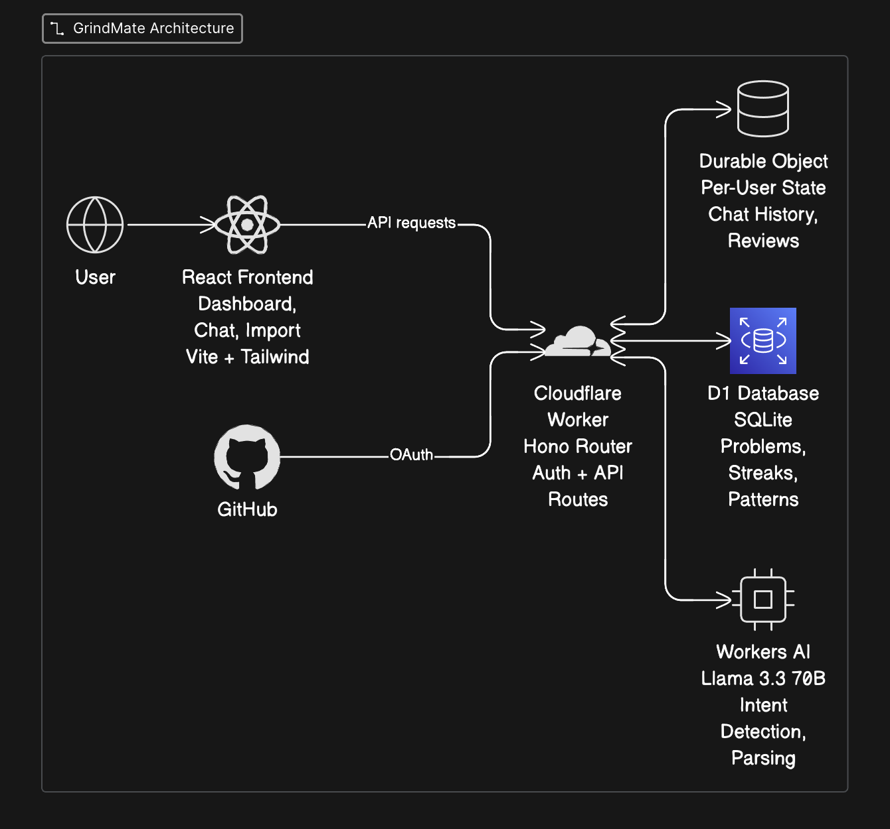

# GrindMate — AI LeetCode Companion

I built this because I was mass-applying to jobs and grinding LeetCode like everyone else, but I kept forgetting which problems I'd solved, which patterns I was weak in, and when I last practiced dynamic programming. Spreadsheets felt tedious. I wanted something that understood natural language — "solved two sum easy 10 min" — and tracked everything automatically.

GrindMate is a full-stack app that runs entirely on Cloudflare's edge. You log problems by chatting with it, it extracts patterns and difficulty using AI, tracks your streaks, and tells you what to practice next. Each user gets isolated data via GitHub OAuth — your practice history is yours alone.

**Live:** [grindmate.sanketjanger15.workers.dev](https://grindmate.sanketjanger15.workers.dev)

---

## How it works

```
React Frontend → Cloudflare Worker (Hono) → Durable Object → D1 + Workers AI
```

**Frontend** is React + Vite + Tailwind, served directly from the Worker. Three pages: Dashboard (charts and stats), Chat (AI interface), and Import (coming soon). The sidebar lets you switch views. Dark theme throughout.

**Worker** (`src/index.ts`) is a Hono router handling API routes and GitHub OAuth. It's the entry point for every request. Auth routes redirect to GitHub, exchange codes for tokens, and set session cookies. API routes proxy to the Durable Object for the logged-in user.

**Durable Object** (`src/agent.ts`) is the interesting part. Each user gets their own DO instance, identified by their GitHub username. The DO holds chat history, review queue, and handles all the logic — logging problems, calculating streaks, scheduling spaced repetition reviews. State persists across requests without a database call.

**D1** is Cloudflare's SQLite-at-the-edge. Three tables: `problems` (what you solved), `daily_activity` (for streak calculation), and `pattern_progress` (mastery tracking).

**Workers AI** runs Llama 3.3 70B for three tasks: intent detection (what does the user want?), problem parsing (extract title, difficulty, patterns from natural language), and recommendations (what to practice next based on your gaps).

---

## Architecture



---

## Features

- **Natural Language Logging** — "Solved LC 121 Two Sum, easy, 15 min, struggled"
- **Pattern Tracking** — Auto-categorizes into 20+ patterns (DP, sliding window, graphs, etc.)
- **Smart Recommendations** — AI suggests problems based on weak areas
- **Streak Tracking** — Daily streaks with longest-streak records
- **Weekly Summaries** — Review progress and identify trends
- **Spaced Repetition** — Struggled problems scheduled for review at 1, 3, and 7 days
- **GitHub OAuth** — Secure login, per-user isolated data
- **Dashboard** — Pie charts, bar charts, weak pattern alerts

---

## The architecture decisions

**Why Durable Objects instead of just D1?**

D1 is great for structured queries, but chat history and review queues need fast read/write without cold queries. DOs keep state in memory between requests — the chat feels instant. Also, DOs support alarms (scheduled wake-ups), which power spaced repetition without a separate cron service.

**Why Hono over Express?**

Hono is built for edge runtimes. It's 14kb, TypeScript-first, and the API is nearly identical to Express. On Cloudflare Workers you can't use Express anyway — it relies on Node APIs that don't exist at the edge.

**Why GitHub OAuth instead of email/password?**

No password storage, no email verification, no "forgot password" flow. GitHub is the right choice for a dev tool — everyone already has an account.

**Single-table vs multi-table?**

I use separate tables (`problems`, `daily_activity`, `pattern_progress`) rather than one events table. The queries are different — problems need filtering by difficulty, daily activity needs date aggregation, pattern progress needs simple lookups. Separate tables = simpler queries.

---

## What the AI does

The AI isn't a generic chatbot. It's a structured agent with specific capabilities:

**Intent detection** classifies every message:
- `LOG_PROBLEM` — "solved two sum easy"
- `GET_STATS` — "how am I doing"
- `GET_RECOMMENDATION` — "what should I practice"
- `GET_WEEKLY_SUMMARY` — "weekly report"
- `GET_REVIEWS` — "what's due for review"
- `GENERAL` — anything else

**Problem parsing** extracts structured data:
```
Input:  "finished LC 42 trapping rain water hard 45 min struggled"
Output: {
  leetcode_id: 42,
  title: "Trapping Rain Water",
  difficulty: "hard",
  patterns: ["arrays", "two_pointers", "stack"],
  time_spent_min: 45,
  struggled: true
}
```

**Recommendations** analyze your pattern progress and recent solves. If you haven't touched DP in two weeks, it'll push you toward DP problems.

---

## Spaced repetition

When you log a problem with "struggled", the system schedules reviews using Leitner intervals:

```
Day 0: Solve problem, mark struggled
Day 1: First review scheduled
Day 3: Second review scheduled  
Day 7: Third review scheduled
```

This uses Durable Object alarms — `this.state.storage.setAlarm(timestamp)` schedules the DO to wake up. The dashboard shows "Reviews Due" count.

---

## Tech Stack

| Component | Technology |
|-----------|------------|
| **Runtime** | Cloudflare Workers |
| **State** | Durable Objects |
| **Database** | D1 (SQLite) |
| **AI** | Workers AI (Llama 3.3 70B) |
| **Router** | Hono |
| **Frontend** | React 19 + Vite + Tailwind CSS |
| **Charts** | Recharts |
| **Auth** | GitHub OAuth |

---

## Database Schema

```sql
-- What you've solved
CREATE TABLE problems (
    id INTEGER PRIMARY KEY AUTOINCREMENT,
    leetcode_id INTEGER,
    title TEXT NOT NULL,
    difficulty TEXT CHECK(difficulty IN ('easy', 'medium', 'hard')),
    patterns TEXT,           -- JSON: ["arrays", "hash_map"]
    time_spent_min INTEGER,
    struggled BOOLEAN DEFAULT FALSE,
    solved_at TIMESTAMP DEFAULT CURRENT_TIMESTAMP
);

-- For streak calculation
CREATE TABLE daily_activity (
    date TEXT PRIMARY KEY,
    problems_solved INTEGER DEFAULT 0,
    total_time_min INTEGER DEFAULT 0
);

-- Pattern mastery
CREATE TABLE pattern_progress (
    pattern TEXT PRIMARY KEY,
    solved_count INTEGER DEFAULT 0,
    last_practiced TIMESTAMP
);
```

---

## What I learned building this

**Durable Objects are underrated.** The mental model is weird at first — it's not a database, not a cache, not a server. It's a stateful actor that lives at the edge. Once it clicks, you realize it solves a whole class of problems (per-user state, WebSockets, rate limiting) without spinning up Redis.

**Tailwind v4 changed the setup.** The old `@tailwind base; @tailwind components; @tailwind utilities;` doesn't work. Now it's `@import "tailwindcss";` with the Vite plugin. Spent an hour debugging white screens.

**LeetCode blocks cloud IPs.** Built a full import feature — works from localhost, blocked from Cloudflare Workers. LeetCode returns 403 for cloud provider IPs. Chrome extension is the workaround.

**OAuth callback URLs matter.** Development uses `localhost:8787/auth/callback`. Production uses your workers.dev domain. Forget to update GitHub OAuth settings = cryptic "redirect_uri mismatch" error.

**Secrets need `.dev.vars` locally.** `wrangler secret put` only works for deployed Workers. Locally, you need a `.dev.vars` file.

---

## Quick Start

### Prerequisites

- Node.js 18+
- Cloudflare account (free tier works)
- Wrangler CLI: `npm install -g wrangler`
- GitHub OAuth App ([create one](https://github.com/settings/developers))

### 1. Clone & Install

```bash
git clone https://github.com/SanketJanger/GrindMate.git
cd GrindMate
npm install
cd frontend && npm install && cd ..
```

### 2. Create D1 Database

```bash
wrangler d1 create grindmate-db
```

Copy the `database_id` into `wrangler.toml`.

### 3. Set Secrets

```bash
wrangler secret put GITHUB_CLIENT_ID
wrangler secret put GITHUB_CLIENT_SECRET
wrangler secret put SESSION_SECRET   # any random string
```

For local dev, create `.dev.vars`:
```
GITHUB_CLIENT_ID=your_id
GITHUB_CLIENT_SECRET=your_secret
SESSION_SECRET=any_random_string
```

### 4. Run Migrations

```bash
# Local
npx wrangler d1 execute grindmate-db --local --file=./schema.sql

# Production
npx wrangler d1 execute grindmate-db --remote --file=./schema.sql
```

### 5. Local Development

```bash
# Terminal 1 — Backend
npx wrangler dev --remote

# Terminal 2 — Frontend
cd frontend && npm run dev
```

Open `localhost:5173`.

---

## Deployment

```bash
# Build frontend
cd frontend && npm run build
cp -r dist/* ../public/

# Deploy
cd .. && npx wrangler deploy
```

Update your GitHub OAuth callback URL to:
```
https://grindmate.<YOUR_SUBDOMAIN>.workers.dev/auth/callback
```

---

## Usage Examples

**Log a problem:**
```
Solved LC 121 Best Time to Buy Stock, easy, 15 min
Just finished Two Sum — struggled, medium, 40 min
Completed LC 42 Trapping Rain Water, hard
```

**Get recommendations:**
```
What should I practice today?
What patterns am I weak at?
```

**View stats:**
```
Show my stats
How am I doing?
```

**Weekly summary:**
```
Weekly summary
How was my week?
```

---

## Screenshots

### Dashboard


### Chat


---

## Patterns Tracked

Arrays · Strings · Two Pointers · Sliding Window · Hash Map · Stack · Queue · Linked List · Binary Search · Sorting · Heap · Trees · Graphs · BFS · DFS · Dynamic Programming · Greedy · Backtracking · Bit Manipulation · Math

---

## Roadmap

- [x] Natural language problem logging
- [x] Pattern extraction with AI
- [x] Spaced repetition scheduling
- [x] GitHub OAuth + per-user isolation
- [x] React dashboard with charts
- [ ] Chrome extension for LeetCode auto-import
- [ ] Email/push reminders for due reviews

---

## Acknowledgments

- [Cloudflare Workers](https://workers.cloudflare.com/) — Serverless compute at the edge
- [Workers AI](https://developers.cloudflare.com/workers-ai/) — Llama 3.3 70B inference
- [Hono](https://hono.dev/) — Lightweight web framework

---

*Built by [Sanket Janger]